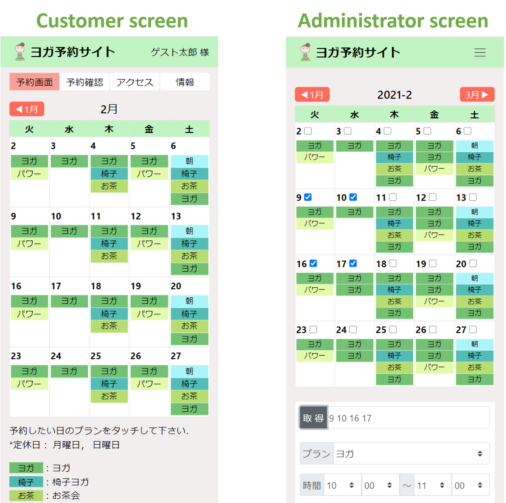
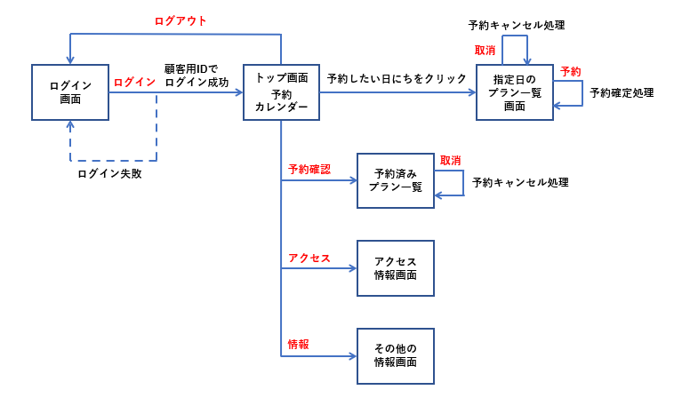
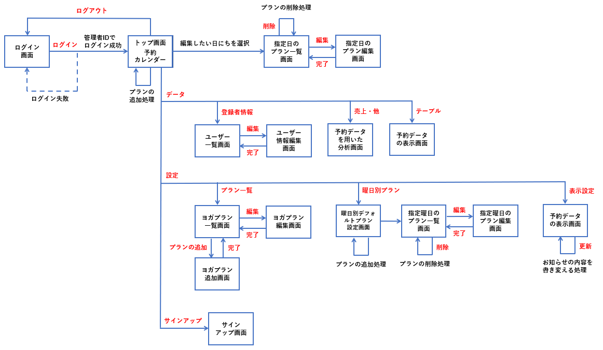

# <div align="center">ヨガ予約アプリ</div>  

###### <div align="center">Djangoで実装したヨガ教室の予約サイトです．</div>  
###### <div align="center">管理者は簡潔にヨガプランを作成できます．</div>
###### <div align="center">高齢者でも見やすく直感的に操作できるUI/UXを実装しました．</div>

<div align="center">

</div>

---  

## URL
以下のサイトでご自由に試用できます．（スマホ推奨）  
https://jay-yoga.club/login/  
以下いずれかのIDでログインしてください．  
顧客用の画面： guest  
管理者の画面： admin

## 使用技術・ライブラリ 
- Python 3.6.9
- Django 3.0.5
- PostgreSQL 12.5
- Nginx 1.18.0
- django-pandas 0.6.2
- Pillow 7.1.1

## 画面遷移図
#### 顧客用画面

##### 顧客用のIDでログインした場合，顧客用予約画面に遷移します． 

<div align="center">

</div>

#### 管理者用画面

##### 管理者用のIDでログインした場合，管理者画面に遷移します．  

<div align="center">

</div>

## 機能一覧
- ユーザー登録，ログイン機能
#### 顧客用画面
- 予約，キャンセル機能
#### 管理者用画面
- 日にち別プランの組み込み機能
- 日にち別プランの編集機能
  - 時間や場所の編集
  - プランの削除
  - 予約者の追加，取消
- ヨガプランの編集機能
  - 新たなプランの作成
  - 時間や予約人数，会場の編集
- お知らせ機能
- 簡易プラン組み込み機能
  - 予め曜日ごとにプランを作成
  - ワンクリックで毎週にプランを組み込む
- 表示曜日のカスタマイズ
- データ閲覧機能
  - 顧客情報の閲覧，編集
  - 予約データから売上，ピボットテーブルを出力
  - dbテーブルの出力


## 本アプリの特徴
  
### 顧客側の特徴・メリット 
- 高齢者でも操作しやすいUI/UX（スマホ推奨）
- ログイン後，予約確定までわずか2クリックのみ
- ページが「予約画面」，「予約確認画面」，「アクセス」，「情報」の4つのみ

### 管理者側の画面
- 直観的に操作できるUI/UX
- 曜日ごとにデフォルトプランを作成しておき，予約プランをまとめて作成できる
- ヨガプランを上限なく追加
- 管理者側から予約者の追加やキャンセルが可能
- 登録者情報の閲覧・変更，csvファイルでの出力が可能
- データ分析による売り上げや分析結果の閲覧

## Setup
以下の手順でコマンドコマンドを打ち込むことでローカルで使用いただけます．  
なお，Python3とDjangoを予めインストールされていることを前提とします．  

```bash
python3 -m pip install django-pandas
python3 -m pip install Pillow

git clone https://github.com/jay0423/yogaproject.git

cd yogaproject
python3 manage.py runserver
```

上記の手順で`python3 manage.py runserver`でローカルサーバーを起動した後，http://localhost:8000/login へアクセスし，ID: admin で管理者画面にログインできます．

## アプリの使用方法
使用方法は https://github.com/jay0423/yogaproject/blob/master/static/manual.pdf をご覧ください．
  
## Authors
Name: Jumpei Kajimoto  
Email: jay0423@i.softbank.jp
  
